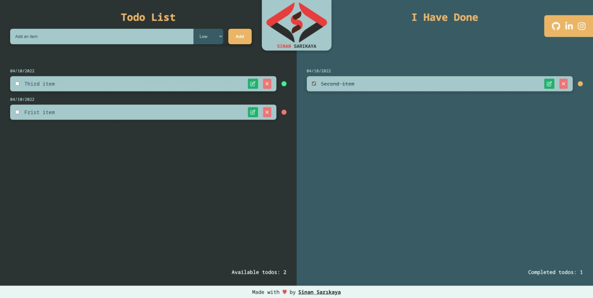

# JavaScript Todos App


Responsive todos app made using JavaScript.

<hr />

### Installation Options

```
$ https://github.com/sinansarikaya/javascript-todos-app.git
```

<hr />

### Demo

#### [View Demo](https://sinansarikaya.github.io/javascript-todos-app/)



<hr />

### Try yourself

You can try to make it yourself by looking at the design in Figma.

#### [View the design in Figma](https://www.figma.com/file/JO3APK6ZuttLbOMrs6LMsi/ToDo-List?node-id=0%3A1)
